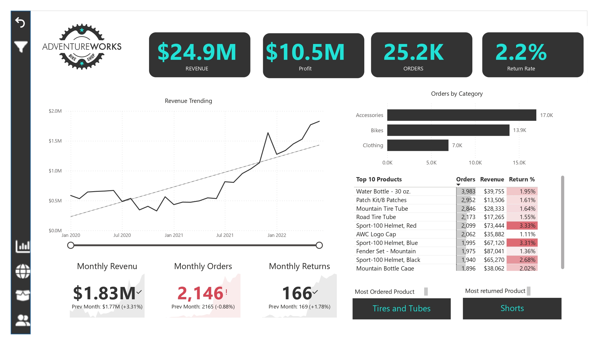

# Adventure Works

This is the project i have done as part of my learning Maven Analytices on Udemy.

## 📁 Projects Included

- **[Adventure Works Project](#)**: A detailed project analyzing sales and performance metrics using Power BI. Includes features such as custom tooltips, Q&A, Decomposition Tree, and Key Influencers.

## 🚀 Getting Started

1. **Clone the Repository**: 
   ```bash
  git clone https://github.com/sivakumar198/Power-BI-Projects.git

2.**Open the Project**: Use Power BI Desktop to open the .pbix files provided in each project folder.

3.**Explore the Dashboards**: Review the reports and dashboards to understand the visualizations and insights.

## 🔧 Tools and Technologies
- Power BI Desktop
- Data Modeling
- DAX (Data Analysis Expressions)
- Power Query
## 🤝 Contributions
Feel free to contribute by opening issues or submitting pull requests. Your feedback and improvements are welcome!

## 📫 Contact
For any questions or inquiries, please reach out to kondetisiva87@gmail.com.

## Project Showcase




